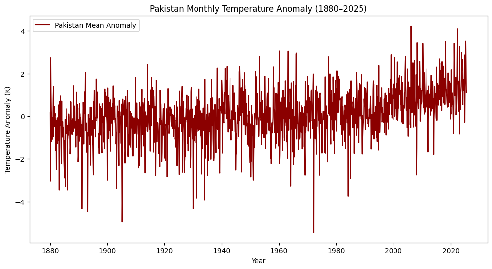
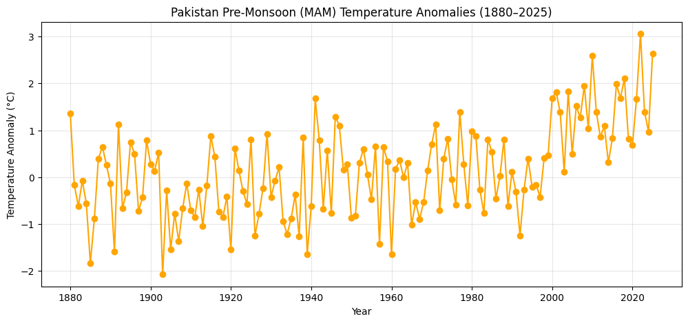

# Climate Anomalies in Pakistan (1880–2025)

Flooding in Pakistan is an annual crisis intensified by climate change, driven by heavier monsoon rains, faster Himalayan glacial melt, and stressed drainage infrastructure. On average, floods displace 3–5 million people each year, destroying nearly 800,000 homes and damaging up to 2 million acres of cropland. The 2022 super floods, linked to unprecedented monsoon intensity and warming, impacted 33 million people and caused over $30 billion in losses, highlighting how global climate change is amplifying Pakistan’s vulnerability to extreme weather.

“This project analyzes climate anomaly data for Pakistan (1880–2025) using exploratory data analysis and time-series forecasting. The goal is to measure long-term warming trends, smooth seasonal fluctuations, and build predictive models to forecast future temperature changes related to Floods. By focusing on Pakistan, a climate-vulnerable country , the study highlights both historical climate change impacts and future risks.”

This repository contains the notebook **`main.ipynb`**, which analyzes historical and future temperature anomaly trends for Pakistan using NASA GISTEMP data.

## Repository Contents
- `main.ipynb` — Jupyter notebook with code, visuals, and findings.
- `flood_analysis.ipynb` — Jupyter notebook with code, visuals, and findings.
- `README.md` - Summary of Project 


## Dataset Source
The dataset used to conduct this study is NASA GISTEMP v4: https://data.giss.nasa.gov/gistemp/

Since, Pakistan is the main focus, Subset: Pakistan’s latitude (24–37°N) and longitude (60–77°E).

## Data Cleaning & Preparation  

During the preparation phase, the following tasks were carried out:  
- Data loading and initial inspection (shape, columns, missing values).  
- Handling nulls, duplicates, and inconsistent formats.  
- Converting data types (dates, numerical fields).  
- Filtering relevant subsets (e.g., Pakistan region anomalies).  
- Creating derived variables (rolling averages, seasonal groupings).

 


# Climate Change Anomalies in Pakistan (1880–2025)

## 1. Introduction

- **Problem Statement**: Climate change is one of the greatest challenges of the 21st century. Pakistan, being highly vulnerable due to its geography and reliance on agriculture, faces significant risks from rising temperatures.

- **Goal of Study**: To analyze historical temperature anomaly data for Pakistan, understand long-term warming trends, seasonal patterns, and forecast future anomalies.

- **Dataset Used**: NASA GISTEMP v4 gridded monthly temperature anomaly dataset (1880–2025), subset for Pakistan’s latitude and longitude.

## 2. Exploratory Data Analysis (EDA)
- **Coverage:** Data spans 1880–2025; monthly; no major gaps.
- **Raw anomalies:** High short-term variability with an upward drift.
- **Smoothed trend:** 12‑month rolling average shows clear warming post‑1970.
- **Decadal means:** Each recent decade warmer than the previous; 2010s/2020s highest.
- **Seasonality:** Winters warming faster than summers.
- **Distribution:** Shift toward positive anomalies; extreme hot months more frequent.
- **Decomposition:** Trend ↑, stable seasonality, residual captures noise.

## 3. Forecasting (Time Series Modeling)
- **Approaches:** ARIMA/SARIMA and Prophet models;
- **Outcome:** Continued warming; future anomalies remain above historical baseline.

## 4. Discussion
- **Implications:** Agriculture stress, water shortages, health impacts; winter warming reduces snowmelt supply.
- **Limitations:** Only temperature anomalies modeled; not precipitation/extreme events; global modes (e.g., ENSO) not explicitly controlled.

## 5. Conclusion
- Warming clear since 1880, accelerating post‑1970.
- Winters warming faster.
- Forecasts indicate sustained rise; Pakistan remains climate‑vulnerable and needs adaptation across agriculture, water, and disaster preparedness.

---

# Results & Figures 

## 1 : EDA-Global & Pakistan Anomaly Trends
Loaded NASA GISTEMP v4 monthly anomalies and validated coverage, Than visualized Pakistan vs global series and applied 12‑month rolling means.

 

 

**Results** Both global and Pakistan series warm markedly post‑1970, Pakistan’s variability is higher but follows the global upward drift.

## 2 : Regional Breakdown-North, South, East (Punjab) Slopes and Season by Season Analysis 
Aggregated gridded anomalies by region and estimated linear warming rates.

  

**Results** North (mountains) warms fastest (~0.13 °C/decade), East/Punjab ~0.11 °C/decade (agri‑critical), South ~0.09 °C/decade (heat‑stress compounding).

**Monthly Analysis**

  

**Decadal Averages**

  


## 3: Change Point Detection-1970s Acceleration
Computed rolling 10‑year slopes and inspected structural shifts.

  

**Results** Persistent positive rates after the 1970s indicate a regime shift to sustained warming, higher baseline risk for heat, melt and water stress. This structural change drives intensified glacial melt, heatwaves, and water stress, amplifying climate vulnerability across agriculture, health, and disaster risk.

## 4: Extreme Event Analysis-Top Hottest Years
Ranked annual means and monthly extremes.

  


**Results** Top‑10 hottest years cluster after 2000, showing a frequent extremes (aligns with observed heatwaves and 2022 anomalies). This shows that 2025 is the hottest year till date. 

## 5: Pakistan vs Global Comparison
Overlayed Pakistan and global anomalies; compared decadal means.

**Results** Pakistan’s warming is broadly in line with global trends but exhibits sharper peaks, reflecting regional sensitivity to large‑scale climate modes.

## 6: Forecast : Prophet (with Uncertainty Bands)
Used Prophet on monthly anomalies and generated 10–20y forecasts with uncertainty intervals.

  
*Figure: Prophet forecast (10–20 years) with uncertainty bands showing continued warming in Pakistan.*  

**Results** Median trajectory remains above historical baseline with rising anomalies; intervals reinforce high probability of continued warming. According to the prophet's model, there is recent rise is more intense warming. 

## 7: Policy & Societal Insights with Spatial Heatmaps

Plot Pakistan map with temperature anomalies averaged for two eras:

1. 1900–1950 (baseline)
2. 2000–2025 (recent warming)

These show how northern Pakistan (mountains) experiences more intense warming.

  

Here are results suggest that : 

Winters warming faster: This threatens water availability, since less snowpack and earlier snowmelt reduce long-term Indus River flow.

Summers heating steadily: Even moderate increases worsen heatwaves, urban heat stress, and crop damage during peak growing seasons.

Climate imbalance: Unequal seasonal warming reshapes Pakistan’s climate system , reducing winter chill, shifting growing seasons, and compounding summer heat risks.

**Purpose & Impact**:
Direct policy relevance → heat stress on humans, crops, livestock. Winters warming slower → risk to Indus River water cycle, glacier melt patterns. Connects climate data → agriculture & food security.

**Agriculture:** Heat stress threatens wheat/rice/cotton yields → invest in heat‑tolerant seeds and modern irrigation.

**Water/Glaciers:** Northern warming accelerates melt → expand storage, basin management.

**Urban Health:** Heatwaves intensify in southern cities → heat action plans, cooling access.

**Disaster Risk:** Extremes cluster post‑2000 → stronger early warnings/NDMA capacity.

**Climate Justice:** Pakistan emits <1% but bears outsized impacts → leverage evidence for climate finance & loss‑and‑damage.


# Flood Risks in Climate Change

Flood risk in Pakistan is strongly linked to warming and monsoon interactions and as well as glacier melt. 

1. DJF (winter) anomalies (North Pakistan only) → proxy for snowpack/glacier melt risk.

  

DJF (North) winters: strong upward shift since ~1980 with frequent > +1–2 °C winters → less snowpack, earlier/stronger melt → higher base river flow before monsoon.


2. MAM (pre-monsoon) anomalies (whole Pakistan) → warmer pre-monsoon air can hold more moisture, leading to heavier rains.

  

MAM (Pakistan) pre-monsoon: clear post-2000 surge (often > +1.5–3 °C) → warmer air holds more moisture → heavier downpours more likely.


3. Long-term warming trend → climate pressure index.

  

10-yr rolling trend: mostly positive after the late 1970s, peaking around ~2000 and staying above zero recently → sustained background warming that amplifies extremes.


### Flood-Conducive Climate Index (FCCI)

The warm DJF (north), warm MAM (Pakistan), and the decadal warming trend into a standardized index. Years above the 75th percentile are tagged High climate flood risk, reflecting snowmelt-plus-monsoon conditions enhanced by climate change.

  

Pakistan has entered a regime of persistently high flood-conducive climate conditions, with recent decades firmly in the high-risk zone, matching observed flood disasters like 2010 and 2022.

### High climate flood-risk ( 2030-2040)

1880–1970:
FCCI mostly below or around 0.
Flood-conducive climate years rare, occasional spikes.

1970–2000:
FCCI rises more often into positive zone. This aligns with Pakistan’s major flood years (1973, 1976, 1992).

2000–2025:
FCCI frequently above 75th percentile (High risk zone). Matches the era of catastrophic floods (2010, 2011, 2012, 2022).


2025–2040 Forecast:
Point forecast (orange) stays above the median, often near high-risk threshold. Uncertainty band widens but remains mostly positive → floods remain likely and persistent. Strong signal that flood-conducive years will dominate future decades.

  

FCCI graph proves that since the 1970s Pakistan has entered an era of structurally elevated flood risk, and the forecast suggests this high-risk regime will persist into the 2030s and 2040s due to climate change. 

---

##  Environment & Dependencies
Python ≥ 3.9. Main libraries: pandas, numpy, matplotlib, seaborn, scikit‑learn, plotly.

```bash
python -m venv .venv
# Windows
.venv\Scripts\activate
# macOS/Linux
source .venv/bin/activate
pip install -U pip pandas numpy matplotlib seaborn scikit-learn plotly prophet pmdarima
```

## References 

1. https://data.giss.nasa.gov/gistemp/ 
2. https://seaborn.pydata.org/ 
3. https://scikit-learn.org/stable/
4. https://matplotlib.org/ 

# Conclusion 

Pakistan’s climate record (1880–2025) shows a clear and accelerating warming trend, with anomalies now consistently above +1°C in recent decades. Winters are warming faster than summers, already disrupting water cycles, snowmelt patterns, and agricultural growing seasons.
Regional analysis reveals the north heating fastest, threatening glaciers and water security, while Punjab and the south face intensifying crop stress and deadly heatwaves.
Pakistan has entered a regime of persistently high flood-conducive climate conditions, with recent decades firmly in the high-risk zone — matching observed flood disasters like 2010 and 2022. Pakistan has entered an era of structurally elevated flood risk, and the forecast suggests this high-risk regime will persist into the 2030s and 2040s due to climate change. 


